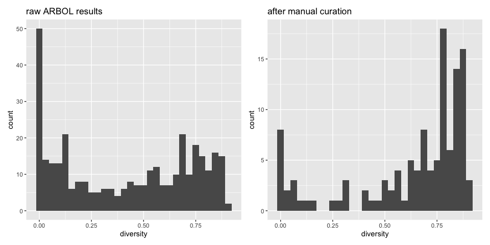
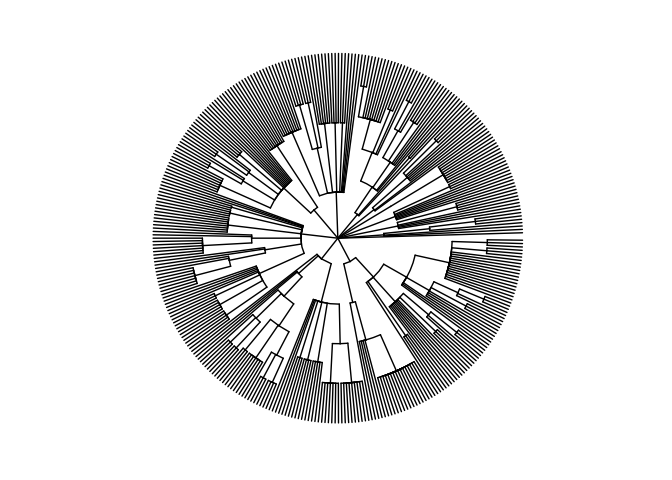
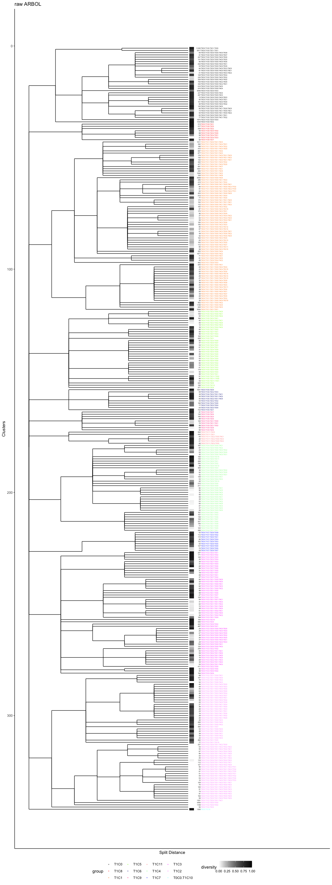
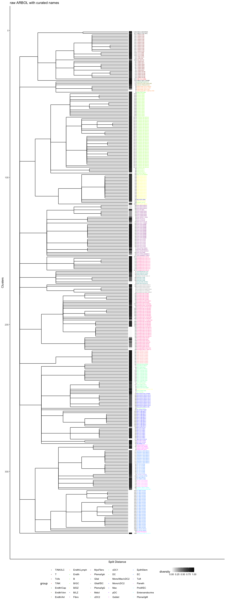
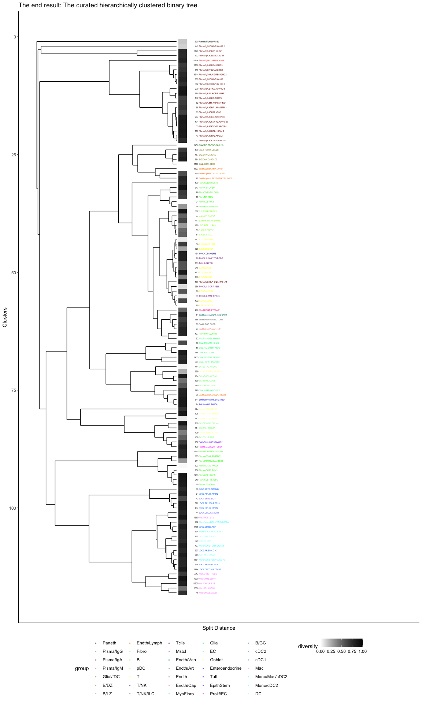
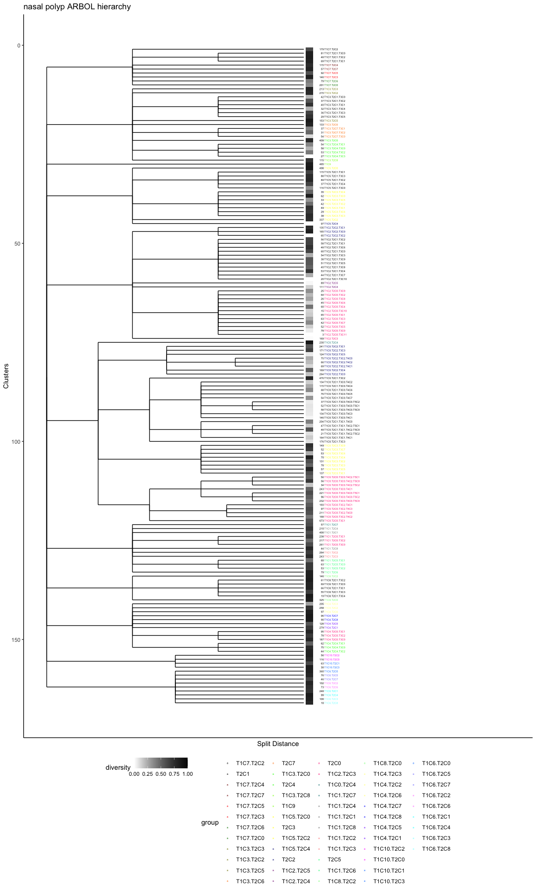
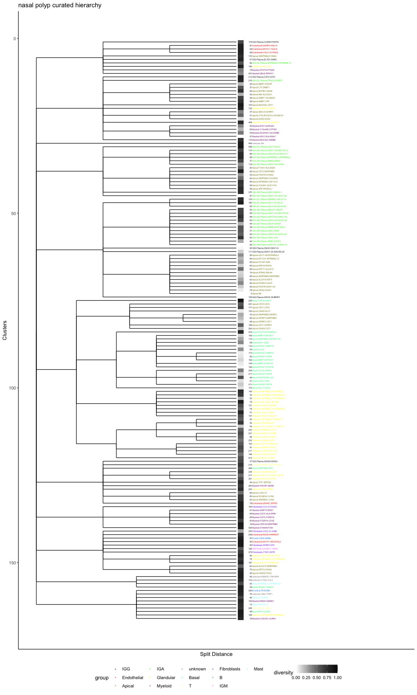
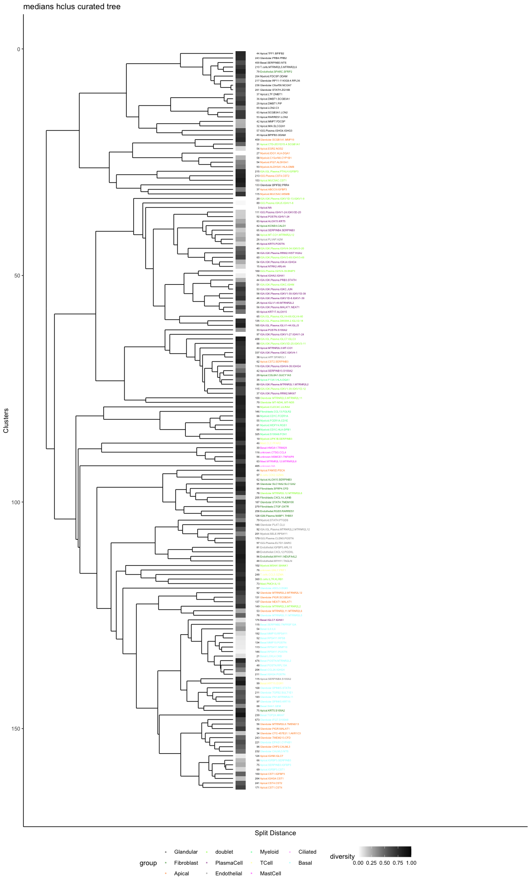

#### [Ben Doran](https://github.com/BenjaminDoran) and [Kyle Kimler](https://github.com/kylekimler)

#### Compiled: August 13, 2021

ARBOL iteratively explores axes of variation in scRNAseq data by
clustering and subclustering until variation between cells in
subclusters becomes noise. The philosophy of ARBOL is that every axis of
variation could be biologically meaningful, so each should be explored.
Once every possibility is explored, curation and a statistical
interrogation of the resolution are used to collapse clusters into the
elemental transcriptomes of the dataset. ARBOL inherently builds a tree
of subclustering events. As data is separated by the major axes of
variation in each subset, further rounds capture less pronounced
variables. This comes with some caveats: variation shared by all
celltypes make up one of the major axes of variation in the first round
of clustering. Celltypes can split up at the beginning, so the same
splitting of e.g. B and T cells might happen further down in separate
branches. Thus the resulting clustering tree is neither indicitave of
true distances between end clusters nor a tree of unique groupings. We
address this by manual curation of cell types, subtypes, and states,
using literature-defined markers in the end clusters, an [end-cluster
naming method](https://kylekimler.shinyapps.io/shinyrank/) that captures
the unique markers of the end clusters, and the calculation of a binary
tree of these manually curated end clusters, providing a distance
between the elemental transcriptomes of the dataset.

ARBOL was built to be a modular software. Currently it iterates through
the default Seurat analysis pipeline, with two additions that enable
automation:   - PCs used in clustering are chosen by 15 percent
improvement of variance explained  - clustering parameters are chosen
by maximization of silhouette size on a downsampled parameter scan   
Normalization, dimensionality reduction, clustering, and plotting
methods are set apart in the code in modularized functions to enable
customization.

We saw a need for this software to address the fact that we were
constantly manually subclustering scRNAseq data, and because other
iterative clustering softwares like scPanoView and iterclust are tailor
built for specific clustering methods outside of the Seurat paradigm.

This tutorial uses the following model datasets:   - pediatric FGID
from the paper: 89849 cells x 22431 genes   - Nasal Polyp
([Ordovas-Montanes et al
2018](https://www.nature.com/articles/s41586-018-0449-8)): 19196 cells x
22360 genes

FGID ARBOL
==========

Reproducing figures for the 2021 paper

Running ARBOL
-------------

The [github page](https://github.com/ShalekLab/SCTieredClustering)
describes ARBOL  
ARBOL is called directly on a seurat object:

    srobj <- readRDS("/path/to/full_seurat_object.rds")
    endclustSrobjs <- GenTieredclusters(srobj,
                               saveSROBJdir = "~/tieredoutput/srobjs",
                               figdir = "~/tieredoutput/figdir",
                               SaveEndNamesDir = "~/tieredoutput/endclusts")

Specifying output directories saves QC statistics  
 
  
 

clustering decision metrics

  
 

differential expression results among clusters (and visualizations) at
each level in ‘figdir’

    ##            p_val avg_logFC pct.1 pct.2     p_val_adj cluster  gene
    ## 1: 7.468466e-307  2.148874 0.622 0.061 1.695342e-302       0  CD3D
    ## 2: 1.898258e-290  2.127852 0.664 0.128 4.309047e-286       0  TRAC
    ## 3: 3.575767e-214  1.774795 0.479 0.045 8.116990e-210       0  CD3E
    ## 4: 5.584884e-210  1.798812 0.644 0.225 1.267769e-205       0  IL32
    ## 5: 9.468750e-209  2.275919 0.472 0.055 2.149406e-204       0 KLRB1
    ## 6: 1.609778e-208  1.882106 0.480 0.044 3.654196e-204       0   CD2

  and UMAP visualizations at each tier.  
  
   

Finally, GenTieredClusters() also saves subset seurat objects for each
cluster in ‘srobjs’, and saves files with lists of cells per end-cluster
in ‘endclusts’.  
 

Iterative clustering is enabled by automation of two key parameter
choices. Principle components are chosen using two heuristics: when more
than 500 cells are present, PCs are included if they explain 15% more
variance than the following component. When less than 500 cells,
Seurat’s Jackstraw method is used to calculate significant principle
components. Clustering is performed automatically by performing a
parameter scan on a downsampled dataset using Seurat’s built-in Louvain
clustering. Silhouette measures the ratio of intra-cluster distance to
inter-cluster distance, where a high score means highly distinct
clusters. For stages where we were clustering more than 500 cells, a
randomized subsample of N cells / 10 was used in the parameter scane.

   

Working with ARBOL results
--------------------------

I prefer to load tiered cluster data into a dataframe, which I can use
directly for comparisons or which I can reattach to the full seurat
object’s metadata for annotation, dendrogram production, and other
analysis.

    LoadTiersAsDF <- function(folder='./tieredoutput/endclusts',maxtiers=10) {
      tierfiles <- list.files(folder,full.names=TRUE,recursive=TRUE)
      sample_strings <- sub('\\..*$','',basename(tierfiles))
      sample_strings <- sub('_T0C0_', '',sample_strings)
      tiers <- map2(tierfiles, sample_strings, ~fread(.x,header=FALSE) %>% mutate(id = .y))
      tiers <- rbindlist(tiers) %>% data.frame
      tiers$id <- gsub('_','.',tiers$id)
      tiers <- tiers %>% separate(id,into=paste0('tier',1:maxtiers),sep='\\.',remove=FALSE)
      tiers <- tiers %>% rename(CellID=V1)
      tiers <- tiers %>% data.frame %>% rename(tierNident=id)
      return(tiers)
    }

    fgtiers <- LoadTiersAsDF('~/PREDICT_3p_Paper/FGID/tieredoutput/endclusts')

    print(head(fgtiers))

    ##                                   CellID               tierNident tier1 tier2
    ## 1 p049_T0D_ILE_LPS_3p_AAGACCTTCCCATTTA-1 T0C0.T1C4.T2C0.T3C5.T4C3  T0C0  T1C4
    ## 2 p049_T0D_ILE_LPS_3p_ACGGGCTTCAAACCAC-1 T0C0.T1C4.T2C0.T3C5.T4C3  T0C0  T1C4
    ## 3 p049_T0D_ILE_LPS_3p_ACTGAGTAGTTCGATC-1 T0C0.T1C4.T2C0.T3C5.T4C3  T0C0  T1C4
    ## 4 p049_T0D_ILE_LPS_3p_AGCTTGACAGCCTGTG-1 T0C0.T1C4.T2C0.T3C5.T4C3  T0C0  T1C4
    ## 5 p049_T0D_ILE_LPS_3p_AGTTGGTTCACTGGGC-1 T0C0.T1C4.T2C0.T3C5.T4C3  T0C0  T1C4
    ## 6 p049_T0D_ILE_LPS_3p_CATGGCGAGACGCTTT-1 T0C0.T1C4.T2C0.T3C5.T4C3  T0C0  T1C4
    ##   tier3 tier4 tier5 tier6 tier7 tier8 tier9 tier10
    ## 1  T2C0  T3C5  T4C3  <NA>  <NA>  <NA>  <NA>   <NA>
    ## 2  T2C0  T3C5  T4C3  <NA>  <NA>  <NA>  <NA>   <NA>
    ## 3  T2C0  T3C5  T4C3  <NA>  <NA>  <NA>  <NA>   <NA>
    ## 4  T2C0  T3C5  T4C3  <NA>  <NA>  <NA>  <NA>   <NA>
    ## 5  T2C0  T3C5  T4C3  <NA>  <NA>  <NA>  <NA>   <NA>
    ## 6  T2C0  T3C5  T4C3  <NA>  <NA>  <NA>  <NA>   <NA>

Add ARBOL annotations to the seurat object
------------------------------------------

    srobj <- readRDS('~/PREDICT_3p_Paper/FGID/srobj.rds')

    srobj@meta.data <- srobj@meta.data %>% cbind(as.data.frame(str_split_fixed(srobj@meta.data$CellID,"_",n=6))) %>% dplyr::rename(patient = V1, time_point = V2, tissue = V3, sample_site = V4, seqDirection=V5,barcode=V6)

    srobj@meta.data <- srobj@meta.data %>% left_join(fgtiers,by="CellID")

    print(head(srobj@meta.data))

    ##                                   CellID          curatedname patient
    ## 1 p009_T0D_ILE_LPS_3p_AAACCTGAGACTGTAA-1   T/NK/ILC.MAF.RPS26    p009
    ## 2 p009_T0D_ILE_LPS_3p_AAACCTGAGTAGCCGA-1   T/NK/ILC.CCR7.SELL    p009
    ## 3 p009_T0D_ILE_LPS_3p_AAACCTGAGTAGGCCA-1 Endth/Cap.PLVAP.FLT1    p009
    ## 4 p009_T0D_ILE_LPS_3p_AAACCTGAGTCAAGGC-1   T/NK/ILC.CCR7.SELL    p009
    ## 5 p009_T0D_ILE_LPS_3p_AAACCTGCAACGATGG-1         B.IGHD.FCER2    p009
    ## 6 p009_T0D_ILE_LPS_3p_AAACCTGCAATCCGAT-1   T/NK/ILC.CCR7.SELL    p009
    ##   time_point tissue sample_site seqDirection            barcode
    ## 1        T0D    ILE         LPS           3p AAACCTGAGACTGTAA-1
    ## 2        T0D    ILE         LPS           3p AAACCTGAGTAGCCGA-1
    ## 3        T0D    ILE         LPS           3p AAACCTGAGTAGGCCA-1
    ## 4        T0D    ILE         LPS           3p AAACCTGAGTCAAGGC-1
    ## 5        T0D    ILE         LPS           3p AAACCTGCAACGATGG-1
    ## 6        T0D    ILE         LPS           3p AAACCTGCAATCCGAT-1
    ##                 tierNident tier1 tier2 tier3 tier4 tier5 tier6 tier7 tier8
    ## 1      T0C0.T1C0.T2C1.T3C0  T0C0  T1C0  T2C1  T3C0  <NA>  <NA>  <NA>  <NA>
    ## 2      T0C0.T1C0.T2C1.T3C1  T0C0  T1C0  T2C1  T3C1  <NA>  <NA>  <NA>  <NA>
    ## 3           T0C0.T1C8.T2C1  T0C0  T1C8  T2C1  <NA>  <NA>  <NA>  <NA>  <NA>
    ## 4      T0C0.T1C0.T2C1.T3C1  T0C0  T1C0  T2C1  T3C1  <NA>  <NA>  <NA>  <NA>
    ## 5 T0C0.T1C1.T2C0.T3C1.T4C3  T0C0  T1C1  T2C0  T3C1  T4C3  <NA>  <NA>  <NA>
    ## 6      T0C0.T1C0.T2C1.T3C1  T0C0  T1C0  T2C1  T3C1  <NA>  <NA>  <NA>  <NA>
    ##   tier9 tier10
    ## 1  <NA>   <NA>
    ## 2  <NA>   <NA>
    ## 3  <NA>   <NA>
    ## 4  <NA>   <NA>
    ## 5  <NA>   <NA>
    ## 6  <NA>   <NA>

End cluster diversity analysis
------------------------------

In the paper, we used a diversity metric, the Gini-Simpson’s Index, to
measure diversity of patients in our end clusters to determine if the
cluster was powered for differential analysis. Gini-Simpson’s index is
calculated as

$diversity = 1 - \\lambda = \\sum\_{i=1}^{R} p\_{i}^{2}$

R is the total number of patients in the dataset while *p**i*
is the proportional abundance of each patient in the end clusters.
lambda is subtracted from 1 because in datasets with fewer patients,
lambda will be inflated.

1 indicates equal representation of all patients within a subset and 0
indicates a completely patient specific subset

    tierNdiversity <- srobj@meta.data %>% group_by(tierNident) %>% 
            summarize(diversity = 1 - sum(((table(patient)) / (length(patient)))^2)) 
    curatedNamediversity <- srobj@meta.data %>% group_by(curatedname) %>% 
            summarize(diversity = 1 - sum(((table(patient)) / (length(patient)))^2))

We used patient diversity among end clusters to inform manual curation

    s1 <- ggplot(tierNdiversity,aes(x=diversity))+ geom_histogram() + ggtitle("raw ARBOL results")
    s2 <- ggplot(curatedNamediversity,aes(x=diversity))+ geom_histogram() + ggtitle("after manual curation")
    s1+s2

Building a tree
---------------

    meta <- srobj@meta.data
    meta$pathString <- meta$tierNident
    meta$pathString <- gsub('\\.','/',meta$pathString)
    ARBOLtree <- as.Node(meta) 
    print(ARBOLtree,'majortype','subtype','groundtruth','curatedname',limit=20)

    ##                                   levelName majortype subtype groundtruth
    ## 1  T0C0                                            NA      NA          NA
    ## 2   ¦--T1C0                                        NA      NA          NA
    ## 3   ¦   ¦--T2C1                                    NA      NA          NA
    ## 4   ¦   ¦   ¦--T3C0                                NA      NA          NA
    ## 5   ¦   ¦   °--T3C1                                NA      NA          NA
    ## 6   ¦   ¦--T2C0                                    NA      NA          NA
    ## 7   ¦   ¦   ¦--T3C0                                NA      NA          NA
    ## 8   ¦   ¦   ¦   ¦--T4C0                            NA      NA          NA
    ## 9   ¦   ¦   ¦   ¦   ¦--T5C8                        NA      NA          NA
    ## 10  ¦   ¦   ¦   ¦   ¦--T5C7                        NA      NA          NA
    ## 11  ¦   ¦   ¦   ¦   ¦--T5C0                        NA      NA          NA
    ## 12  ¦   ¦   ¦   ¦   ¦--T5C5                        NA      NA          NA
    ## 13  ¦   ¦   ¦   ¦   ¦--T5C6                        NA      NA          NA
    ## 14  ¦   ¦   ¦   ¦   ¦--T5C1                        NA      NA          NA
    ## 15  ¦   ¦   ¦   ¦   ¦--T5C9                        NA      NA          NA
    ## 16  ¦   ¦   ¦   ¦   ¦--T5C3                        NA      NA          NA
    ## 17  ¦   ¦   ¦   ¦   ¦   ¦--T6C0                    NA      NA          NA
    ## 18  ¦   ¦   ¦   ¦   ¦   ¦--T6C1                    NA      NA          NA
    ## 19  ¦   ¦   ¦   ¦   ¦   °--T6C2                    NA      NA          NA
    ## 20  ¦   ¦   ¦   ¦   °--... 2 nodes w/ 0 sub        NA      NA          NA
    ## 21  ¦   ¦   ¦   °--... 3 nodes w/ 5 sub            NA      NA          NA
    ## 22  ¦   ¦   °--... 3 nodes w/ 23 sub               NA      NA          NA
    ## 23  ¦   °--... 1 nodes w/ 26 sub                   NA      NA          NA
    ## 24  °--... 11 nodes w/ 403 sub                     NA      NA          NA
    ##           curatedname
    ## 1                    
    ## 2                    
    ## 3                    
    ## 4  T/NK/ILC.MAF.RPS26
    ## 5  T/NK/ILC.CCR7.SELL
    ## 6                    
    ## 7                    
    ## 8                    
    ## 9         T.RORA.CCR6
    ## 10        T.RORA.CCR6
    ## 11        T.RORA.CCR6
    ## 12        T.RORA.CCR6
    ## 13        T.RORA.CCR6
    ## 14        T.RORA.CCR6
    ## 15        T.RORA.CCR6
    ## 16                   
    ## 17        T.RORA.CCR6
    ## 18        T.RORA.CCR6
    ## 19        T.RORA.CCR6
    ## 20                   
    ## 21                   
    ## 22                   
    ## 23                   
    ## 24

    ARBOLphylo <- as.phylo(ARBOLtree)

    #For curatednames
    #ARBOLphylo$tip.label <- ARBOLtree$Get('curatedname')[!is.na(ARBOLtree$Get('curatedname'))]
    #For tierNident
    ARBOLphylo$tip.label <- ARBOLtree$Get('tierNident')[!is.na(ARBOLtree$Get('tierNident'))]
    ggtree(ARBOLphylo,branch.length='edge.length',layout='circular')

Display Gini-Simpson’s index next to the tree, in the paper’s style

    plotdendrogram <- function(phyloObj,title) {
        dd.row <- as.dendrogram(phyloObj)
        ddata_x <- dendro_data(dd.row)
        ddata_L <- label(ddata_x)
        ddata_L$label <- str_replace_all(ddata_L$label, "−", "-")
        #For majortype
        #ddata_L$group <- gsub("\\..*$", "", ddata_L$label)
        #For subtype
        ddata_L$group <- gsub("^([^.]+)\\.([^.]+)\\.(.+)$","\\2",ddata_L$label)
        ddata_n <- segment(ddata_x) %>% filter(yend!=0 & yend!=y)
        celltype.colors <- primary.colors(length(unique(ddata_L$group)))
        names(celltype.colors) <- unique(ddata_L$group)

        ddata_L$count = as.numeric(table(factor(srobj$tierNident))[ARBOLphylo$tip.label])

        ddata_L$diversity = srobj@meta.data %>% group_by(tierNident) %>% 
            summarize(diversity = 1 - sum(((table(patient)) / (length(patient)))^2)) %>%
            column_to_rownames('tierNident') %>%
            .[phyloObj$tip.label, ]

        y.scl = .05
        plt <- ggplot(segment(ddata_x)) +
            geom_segment(aes(x=x, y=y*y.scl, xend=xend, yend=yend*y.scl)) + 
            geom_text(data=ddata_L, angle = 0, hjust = 0, size = 1.5,
                      aes(label=label, x=x, y=-.4, color=group)) + 
            geom_text(data=ddata_L, angle = 0, hjust = 1, size = 1.5,
                      aes(label=count, x=x, y=-0.39),color="black") +
            geom_tile(data=ddata_L, aes(x = x, y=-0.11, fill=diversity), height=0.15) +
            scale_color_manual(values=celltype.colors) +
            scale_fill_gradient(low = "white", high = "black", limits=c(0,1)) +
            coord_flip(clip = 'off') + 
            scale_y_reverse(limits = c(max(segment(ddata_x)$y*y.scl),-4)) +
                               #breaks = c(1, 0.75, 0.5, 0.25, 0),
                               #labels = c(1, 0.75, 0.5, 0.25, 0)) +
            scale_x_reverse() +
            theme_classic() + 
            theme(legend.position = "bottom",
                  axis.text.x = element_blank(),
                  axis.ticks.x = element_blank()) +
            ylab("Split Distance") +
            xlab("Clusters") +
            ggtitle(title)

        return(plt)
    }

    p1 <- plotdendrogram(ARBOLphylo, title='raw ARBOL')
    p1

Annotation
----------

In the paper, tiers 1 and 2 were well annotated by comparing Wilcoxon 1
v all results to markers in the literature. End clusters were named
based on the tier1.tier2 combination they belonged to, followed by 2
genes either manually chosen or chosen on a heuristic rank score among
its tier2 group. The rank score is calculated as follows on the results
of a 1 vs. all wilcoxon rank sum test:

$$-\\log (p.adj+(1\*10^{-310})) \* \\log{foldchange} \* \\small\\cfrac{pct.1}{pct.2+1\*10^{-300}}$$

[We also created a shiny
app](https://kylekimler.shinyapps.io/shinyrank/) for understanding how
the weighting the components of the rank score affects gene choice

We can view the raw ARBOL with curated names to get an idea of how we
collapsed clusters

    curatedNamediversity <- srobj@meta.data %>% group_by(curatedname) %>% 
            summarize(diversity = 1 - sum(((table(patient)) / (length(patient)))^2)) 

    ARBOLphylo$tip.label <- ARBOLtree$Get('curatedname')[!is.na(ARBOLtree$Get('curatedname'))]
    p2 <- plotdendrogram(as.phylo(ARBOLphylo),"raw ARBOL with curated names")
    p2

It is important to note that ARBOL can split major cell types in the
earliest stages, so that the final tree may misrepresent the
relationships of the end clusters. To reconstruct those relationships,
we hierarchically clustered euclidean distances between gene medians
among end clusters, building a binary tree    

Binary tree creation
--------------------

While curating the end clusters, we wanted to better understand the
distance between clusters. In the atlas figures 3 and 4, we performed
hierarchical clustering of curated end clusters (not to be confused with
the raw ARBOL: hclus produces a binary tree). Hierarchical clustering
was performed on median expression of a subset of highly DE genes
(approximately 4500) using complete linkage and distance calculated with
Pearson correlation. DE was performed by pairwise expression tests of
end clusters.

    Idents(srobj) <- srobj@meta.data$curatedname
    #markers are selected by pairwise expression tests
    de.df.sct <- lapply(Idents(srobj), function(x) {return(FindMarkers(srobj,ident.1=x))})
    de.df.sct <- bind_rows(de.df.sct)

    genes.use <- de.df.sct$gene

    scaled.data = Matrix::Matrix(srobj@assays$SCT@counts[de.df.sct$gene,])
    scaled.data.t = t(scaled.data)
    scaled.data.t = as.data.frame(scaled.data.t)
    scaled.data.t$cellsubsets = srobj$curatedname

    agg.clst.cntrs = aggregate(scaled.data.t[, -which(colnames(scaled.data.t) == "cellsubsets")],
              list(scaled.data.t$cellsubsets), median)

    colnames(agg.clst.cntrs) <- c("cellsubsets", colnames(agg.clst.cntrs)[2:length(colnames(agg.clst.cntrs))])

    clst.cntrs <- agg.clst.cntrs %>% 
        column_to_rownames("cellsubsets") %>%
        t %>% as.data.frame

The package pvclust was used for hierarchical clustering, bootstrapping
sampling genes. Here I use one bootstrap due to computational
limitations

    library(pvclust)
    result <- pvclust(clst.cntrs, method.dist="cor", method.hclust="complete", nboot=1, parallel=TRUE)

    ## Creating a temporary cluster...done:
    ## socket cluster with 11 nodes on host 'localhost'

    ## Warning in pvclust.parallel(cl = cl, data = data, method.hclust =
    ## method.hclust, : nboot is too small for cluster size. non-parallel version is
    ## executed

    ## Bootstrap (r = 0.5)... Done.
    ## Bootstrap (r = 0.6)... Done.
    ## Bootstrap (r = 0.7)... Done.
    ## Bootstrap (r = 0.8)... Done.
    ## Bootstrap (r = 0.9)... Done.
    ## Bootstrap (r = 1.0)... Done.
    ## Bootstrap (r = 1.1)... Done.
    ## Bootstrap (r = 1.2)... Done.
    ## Bootstrap (r = 1.3)... Done.
    ## Bootstrap (r = 1.4)... Done.

    p3

Nasal Polyp ARBOL
=================

Here is another example of an ARBOL built on another scRNAseq dataset of
nasal polyps.

    ## Warning: Expected 10 pieces. Missing pieces filled with `NA` in 19196 rows [1,
    ## 2, 3, 4, 5, 6, 7, 8, 9, 10, 11, 12, 13, 14, 15, 16, 17, 18, 19, 20, ...].

    tiers <- LoadTiersAsDF(folder = '~/tieredoutput/endclusts')

    nasalp1

    nasalp2

    nasalp3

    ## [1] "Thanks for reading!"

    sessionInfo()

    ## R version 4.1.0 (2021-05-18)
    ## Platform: x86_64-apple-darwin17.0 (64-bit)
    ## Running under: macOS Big Sur 10.16
    ## 
    ## Matrix products: default
    ## BLAS:   /Library/Frameworks/R.framework/Versions/4.1/Resources/lib/libRblas.dylib
    ## LAPACK: /Library/Frameworks/R.framework/Versions/4.1/Resources/lib/libRlapack.dylib
    ## 
    ## locale:
    ## [1] en_US.UTF-8/en_US.UTF-8/en_US.UTF-8/C/en_US.UTF-8/en_US.UTF-8
    ## 
    ## attached base packages:
    ## [1] grid      stats     graphics  grDevices utils     datasets  methods  
    ## [8] base     
    ## 
    ## other attached packages:
    ##  [1] phylogram_2.1.0    dendextend_1.15.1  cowplot_1.1.1      phyloseq_1.36.0   
    ##  [5] rdist_0.0.5        ape_5.5            ggtree_3.0.2       treeio_1.16.1     
    ##  [9] data.tree_1.0.0    Matrix_1.3-4       ggpubr_0.4.0       glmGamPoi_1.4.0   
    ## [13] vegan_2.5-7        lattice_0.20-44    permute_0.9-5      pheatmap_1.0.12   
    ## [17] ggdendro_0.1.22    pvclust_2.2-0      colorRamps_2.3     networkD3_0.4     
    ## [21] viridis_0.6.1      viridisLite_0.4.0  SeuratObject_4.0.2 Seurat_4.0.1      
    ## [25] data.table_1.14.0  forcats_0.5.1      stringr_1.4.0      dplyr_1.0.7       
    ## [29] purrr_0.3.4        readr_2.0.1        tidyr_1.1.3        tibble_3.1.3      
    ## [33] ggplot2_3.3.5      tidyverse_1.3.1    rmarkdown_2.10    
    ## 
    ## loaded via a namespace (and not attached):
    ##   [1] utf8_1.2.2                  reticulate_1.20            
    ##   [3] tidyselect_1.1.1            htmlwidgets_1.5.3          
    ##   [5] Rtsne_0.15                  munsell_0.5.0              
    ##   [7] codetools_0.2-18            ica_1.0-2                  
    ##   [9] future_1.21.0               miniUI_0.1.1.1             
    ##  [11] withr_2.4.2                 colorspace_2.0-2           
    ##  [13] Biobase_2.52.0              highr_0.9                  
    ##  [15] knitr_1.33                  rstudioapi_0.13            
    ##  [17] stats4_4.1.0                ROCR_1.0-11                
    ##  [19] ggsignif_0.6.2              tensor_1.5                 
    ##  [21] listenv_0.8.0               MatrixGenerics_1.4.2       
    ##  [23] labeling_0.4.2              GenomeInfoDbData_1.2.6     
    ##  [25] polyclip_1.10-0             bit64_4.0.5                
    ##  [27] farver_2.1.0                rhdf5_2.36.0               
    ##  [29] parallelly_1.27.0           vctrs_0.3.8                
    ##  [31] generics_0.1.0              xfun_0.25                  
    ##  [33] R6_2.5.0                    GenomeInfoDb_1.28.1        
    ##  [35] rhdf5filters_1.4.0          bitops_1.0-7               
    ##  [37] spatstat.utils_2.2-0        DelayedArray_0.18.0        
    ##  [39] assertthat_0.2.1            vroom_1.5.4                
    ##  [41] promises_1.2.0.1            scales_1.1.1               
    ##  [43] gtable_0.3.0                globals_0.14.0             
    ##  [45] goftest_1.2-2               rlang_0.4.11               
    ##  [47] splines_4.1.0               rstatix_0.7.0              
    ##  [49] lazyeval_0.2.2              spatstat.geom_2.2-2        
    ##  [51] broom_0.7.9                 BiocManager_1.30.16        
    ##  [53] yaml_2.2.1                  reshape2_1.4.4             
    ##  [55] abind_1.4-5                 modelr_0.1.8               
    ##  [57] backports_1.2.1             httpuv_1.6.1               
    ##  [59] tools_4.1.0                 ellipsis_0.3.2             
    ##  [61] spatstat.core_2.3-0         biomformat_1.20.0          
    ##  [63] RColorBrewer_1.1-2          BiocGenerics_0.38.0        
    ##  [65] ggridges_0.5.3              Rcpp_1.0.7                 
    ##  [67] plyr_1.8.6                  zlibbioc_1.38.0            
    ##  [69] RCurl_1.98-1.3              rpart_4.1-15               
    ##  [71] deldir_0.2-10               pbapply_1.4-3              
    ##  [73] S4Vectors_0.30.0            zoo_1.8-9                  
    ##  [75] SummarizedExperiment_1.22.0 haven_2.4.3                
    ##  [77] ggrepel_0.9.1               cluster_2.1.2              
    ##  [79] fs_1.5.0                    magrittr_2.0.1             
    ##  [81] scattermore_0.7             openxlsx_4.2.4             
    ##  [83] lmtest_0.9-38               reprex_2.0.1               
    ##  [85] RANN_2.6.1                  fitdistrplus_1.1-5         
    ##  [87] matrixStats_0.60.0          hms_1.1.0                  
    ##  [89] patchwork_1.1.1             mime_0.11                  
    ##  [91] evaluate_0.14               xtable_1.8-4               
    ##  [93] rio_0.5.27                  readxl_1.3.1               
    ##  [95] IRanges_2.26.0              gridExtra_2.3              
    ##  [97] compiler_4.1.0              KernSmooth_2.23-20         
    ##  [99] crayon_1.4.1                htmltools_0.5.1.1          
    ## [101] mgcv_1.8-36                 later_1.2.0                
    ## [103] tzdb_0.1.2                  aplot_0.0.6                
    ## [105] lubridate_1.7.10            DBI_1.1.1                  
    ## [107] dbplyr_2.1.1                MASS_7.3-54                
    ## [109] ade4_1.7-17                 car_3.0-11                 
    ## [111] cli_3.0.1                   parallel_4.1.0             
    ## [113] igraph_1.2.6                GenomicRanges_1.44.0       
    ## [115] pkgconfig_2.0.3             rvcheck_0.1.8              
    ## [117] foreign_0.8-81              plotly_4.9.4.1             
    ## [119] spatstat.sparse_2.0-0       foreach_1.5.1              
    ## [121] xml2_1.3.2                  multtest_2.48.0            
    ## [123] XVector_0.32.0              rvest_1.0.1                
    ## [125] digest_0.6.27               sctransform_0.3.2          
    ## [127] RcppAnnoy_0.0.19            Biostrings_2.60.2          
    ## [129] spatstat.data_2.1-0         cellranger_1.1.0           
    ## [131] leiden_0.3.9                tidytree_0.3.4             
    ## [133] uwot_0.1.10                 curl_4.3.2                 
    ## [135] shiny_1.6.0                 lifecycle_1.0.0            
    ## [137] nlme_3.1-152                jsonlite_1.7.2             
    ## [139] Rhdf5lib_1.14.2             carData_3.0-4              
    ## [141] fansi_0.5.0                 pillar_1.6.2               
    ## [143] fastmap_1.1.0               httr_1.4.2                 
    ## [145] survival_3.2-11             glue_1.4.2                 
    ## [147] zip_2.2.0                   iterators_1.0.13           
    ## [149] png_0.1-7                   bit_4.0.4                  
    ## [151] stringi_1.7.3               irlba_2.3.3                
    ## [153] future.apply_1.8.1
